.. _toolbars-section:
Toolbars
============================

.. contents:: :local:

Common
-------
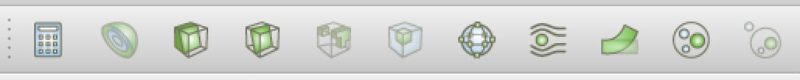

Data Analysis
-------------
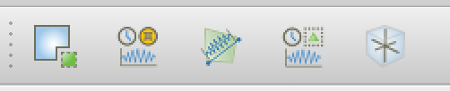

Active Variable Controls
------------------------
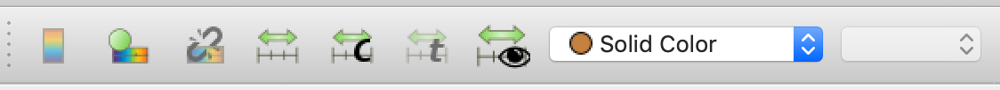

Camera Controls
---------------
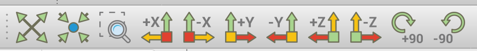

Center Axes Controls
--------------------
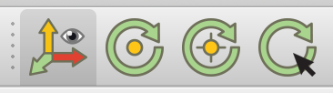

Current Time Controls
---------------------
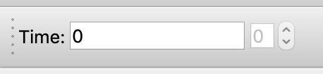

Custom Viewpoints Toolbar
---------------------
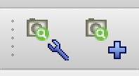

Macros Toolbars
---------------------
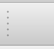

Main Controls
---------------------
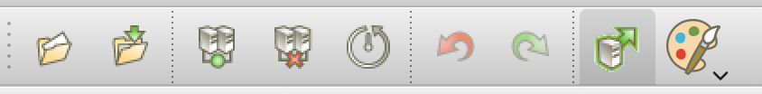

Representation Toolbar
---------------------
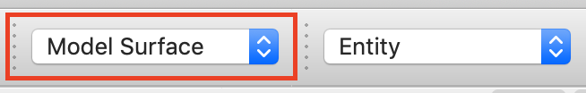

SMTK Color Mode
---------------------
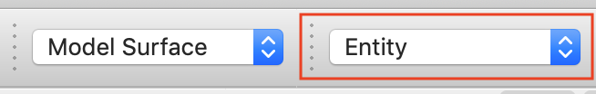

.. _smtk-selection-filters:
SMTK Selection Filters
---------------------
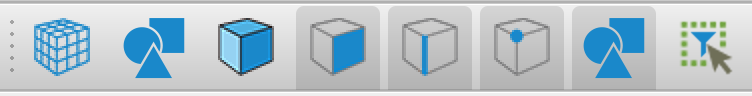

VCR Controls
---------------------

Viewport Controls
--------------------
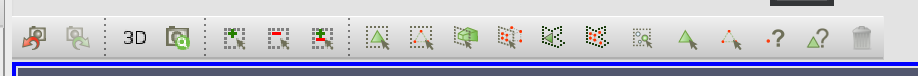

