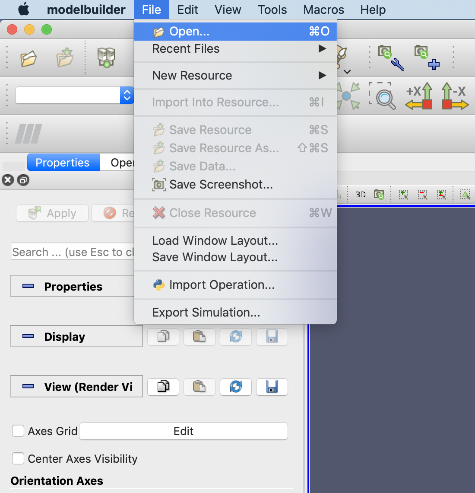
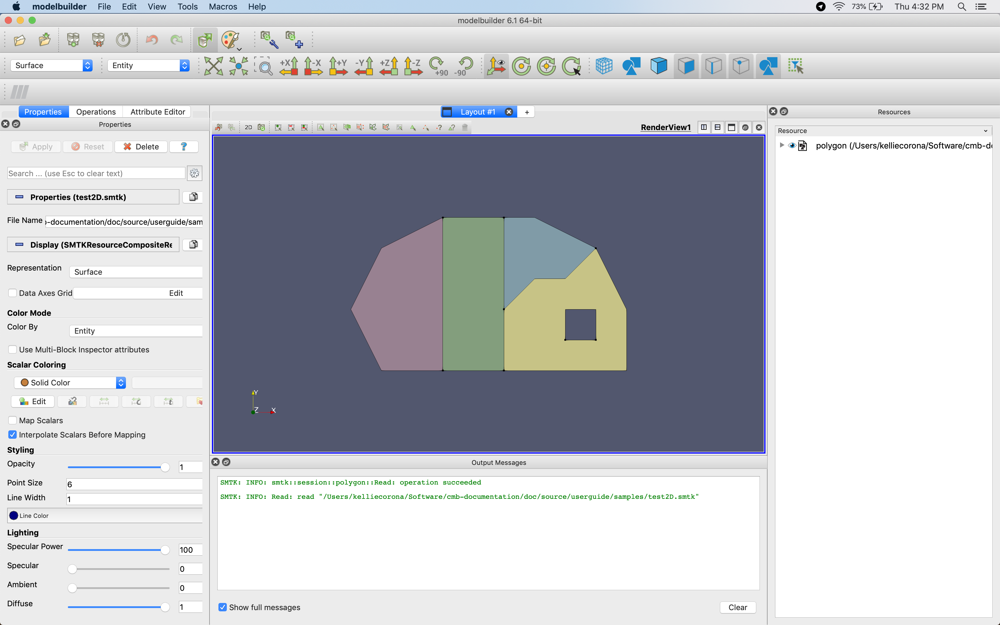
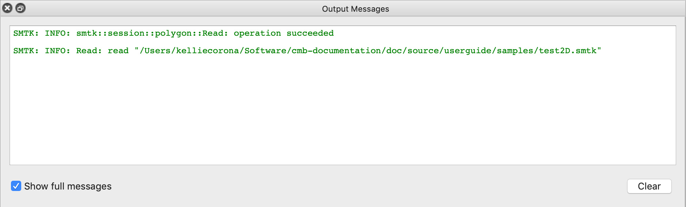
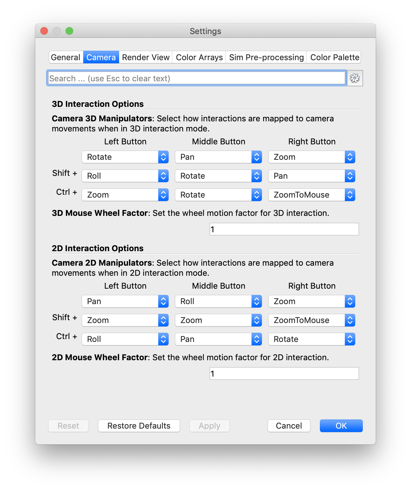
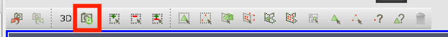
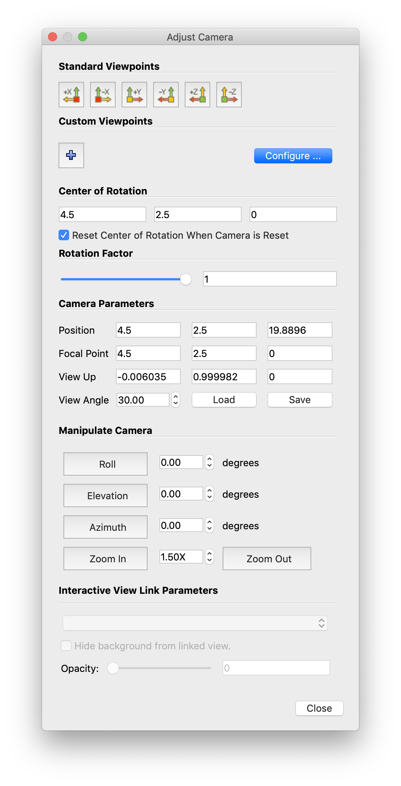

Getting Started
===============

Let's walk through ModelBuilder's basic operations and logic using
|example-link1| and :download:`sample.sbt <samples/sample.sbt>`.

.. |example-link1| raw:: html

   <a
   href="https://gitlab.kitware.com/cmb/smtk-testing-data/tree/master/cmb"
   target="_blank"> test2D.cmb </a>

Opening ModelBuilder
--------------------

After opening ModelBuilder, a window similar to the figure below is displayed:

.. findimage:: images/DefaultScreen.*
  :align: center

However, ModelBuilder panels are tearable so that they can be pulled off and
moved around as independent windows so the user can organize the interface to
their preference.

Managing Plugins
----------------
In order to load a model, a correct plugin must be loaded. The Plugin Manager
can be opened from Tools |->| Mange Plugins:

.. image:: images/LoadPluginsStep1.*

The plugins that come with CMB are located in the "install/lib" directory of the
CMB-SuperBuild. To load a new plugin, select “Load New...” and browse for a
plugin. The plugins will show up in the "Local Plugins" list after being loaded
with a "Loaded" Property. In our case, the smtkDiscreteSessionPlugin needed by
test2D.cmb has already been loaded by default; however, cmbPostProcessingModePlugin
will need to be loaded.

.. image:: images/LoadPluginsStep2.*

Once the CMB Post Processing plugin is loaded, there will be an additional
toolbar in ModelBuilder.

.. image:: images/LoadPluginsStep3.*

Importing Model
---------------

To import an object, click on the "Open" |mbOpen32| icon in the File IO tool bar
or go to File |->| Open (CTRL+O) in the main menu bar.

In the case where there are too many files in the directory, use the "Files of
type" selection to limit the displayed files to those of a certain type and make
finding the target files easier. The file types shown here depend on the loaded
plugins.

To unload all models currently in the scene, click File |->| Close Resource
(CTRL+W).

Let's begin by finding and opening the test2D.cmb file.

Window Layout
-------------
At this point, you should see a window to the following:

The menubar at the top of the screen allows the user to modify settings and
preferences, operate on files and views, and access tools, macros and help.

The following rows of toolbars can be customized by toggling their display in
View |->| Toolbars, then dragging them to the desired location.  The default
interface displays (from top-left to bottom-right) the Main Controls, Custom
Viewpoints Toolbar, Representation Toolbar, SMTK Color Mode, Camera Controls,
Center Axes Controls, and SMTK Selection Filters.  For more information on all
of the toolbars available in ModelBuilder, see the :ref:`Toolbars Section
<toolbars-section>`.

In addition to these toolbars, the mouse can be used to manipulate the
camera-view and pick individual model entities.

The lower portion of the window is the log window, which displays the logs
generated by the smtk server. It gives the user hints when something goes wrong.

Viewport Interaction
--------------------
The camera view in ModelBuilder can be modified using mouse manipulations or
manual numerical adjustments.

For coarse, quick adjustments to the current viewport view, the mouse can be
used in the following ways:

* To rotate in the plane of view, middle-click and drag on the viewport.

* To pan the current view, left-click and drag on the viewport.

* To zoom the current view, right-click and drag on the viewport or use the
  scroll wheel.

These controls can be further customized in the Settings window (image right),
which is accessible from ModelBuilder |->| Preferences.

For precise camera adjustments, access the Adjust Camera window by selecting the
camera icon from the viewport menubar.

From the Adjust Camera window shown below, exact numerical values of the camera
properties can be entered, custom views can be configured, and existing
configurations can be loaded.

Model Interaction
-----------------
There are two major methods to interact with the model entities. One way is to
select entities in the resources tree; the other is to select the entities
directly in the viewport. Viewport selction can occur by either using the
"Select Object" icon |pqSelect32| in the SMTK Selection toolbar or pressing "B"
on your keyboard, then selecting model entities.

.. seealso::
  :ref:`smtk-selection-filters` for the various filters available in
  ModelBuilder to facilitate the viewport selection.

Right-clicking on a face in the viewport will select the face and
bring up a context menu. From this menu, you can hide face, change color, and
change representation (of the object).

.. findfigure:: ModelFaceRightClick.*
  :scale: 60%

Attributes
----------
To load attributes, click the "Open" |pqOpen32| button on the File IO toolbar
and browse for the sample.crf linked above.
Switch to the Attribute tab. Your program should look similar to the figure below.

.. findfigure:: GettingStartedStateLoadedAttributes.*
  :align: center

The attribute view is customized by the template file, so different templates
do not necessarily have the same content. "Show Level" allows the user to present
the information at different levels: in this example "General" and "Advanced" are
used. Attributes can also be grouped into categories so that they can be displayed
by category when too many attributes are present. In this example, the input
parameter in Tab 2 is a "Double 2" under Category 1 and becomes a "String 2"
under Category 2.

|AttributeCategory1| |AttributeCategory2|

Two vertical tabs (Tab 1 and Tab 2) are shown on the right-hand side as examples
of the different sections of the simulation inputs, as shown below:

|AttributeTab1| |AttributeTab2|

Both Tab 1 and Tab 2 are designed to input certain parameters. But Tab 2 has a
table which allows you to insert multiple instances while Tab 1 does not. These
are due to the different types used in their views (coded in sample.crf).

Select File-Save Simulation to save attributes as a CRF file. To export the
attributes as simulation inputs, click on File-Export Simulation Files, the
export interface designed in the template that contains two analysis will be shown:

.. findfigure:: AttributeExport.*

.. Note::
  To export a simulation inputs deck, a Python script is required. For a
  user-created template, it has to be written by the user too. For the templates
  that come with ModelBuilder, the Python scripts are provided.

Finally, clicking File-Close Data or press CTRL-W to close the template after
saving it.

.. |mbOpen32| image:: images/mbOpen32.png
.. |pqSelect32| image:: images/pqSelect32.png
.. |AttributeTab1| image:: images/AttributeTab1.png
   :width: 48%
.. |AttributeTab2| image:: images/AttributeTab2.png
   :width: 48%
.. |AttributeCategory1| image:: images/AttributeCategory1.png
  :width: 48%
.. |AttributeCategory2| image:: images/AttributeCategory2.png
  :width: 48%

.. |->| unicode:: U+02192 .. rarr
